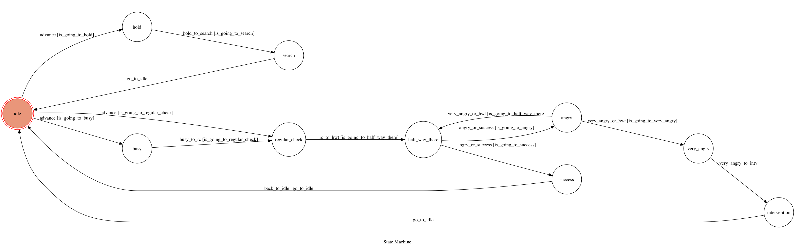

 Project 2017

Template Code for TOC Project 2017

A telegram bot based on a finite state machine
An automatic girl friend's message replier  

## Setup

### Prerequisite
* Python 3

#### Install Dependency
```sh
pip install -r requirements.txt
```

* pygraphviz (For visualizing Finite State Machine)
    * [Setup pygraphviz on Ubuntu](http://www.jianshu.com/p/a3da7ecc5303)

### Secret Data

`API_TOKEN` and `WEBHOOK_URL` in app.py **MUST** be set to proper values.
Otherwise, you might not be able to run your code.

### Run Locally
You can either setup https server or using `ngrok` as a proxy.

**`ngrok` would be used in the following instruction**

```sh
ngrok http 5000
```

After that, `ngrok` would generate a https URL.

You should set `WEBHOOK_URL` (in app.py) to `your-https-URL/hook`.

#### Run the sever

```sh
python3 app.py
```

## Finite State Machine


## Usage
The initial state is set to `idle`.

Every time starts `idle` state is triggered to `advance` to another states.
The next entered state depends on the user input. Here are the cases.

in search mode, you can enter a query and the system will return the similarity and the files.

Before using "/search", make sure to convert all pdf files in `/pdf` to txt files in `/txt`.
```sh
cd pdf/
```

```sh
sh ../pdf2txt.sh
```


* idle
    * Input: "babe"
        * Reply: "I'm here" and a smile GIF

    * Input: "what are you doing"
        * Reply: "I'm thinking about you" and a hug GIF

    * Input: "/search"
        * Reply: "enter search query, in the form of (* your query)"

* search
    * Reply: search results, the files and "back to chat mode"

* hold
    * Input: "* your query"
        * Reply : "searching"

* busy
    * Input: "what are you doing"
        * Reply: "I'm thinking about you" and a hug GIF

* regular_check
    * Input: "okay"
        * Reply: "I love you" and a kiss GIF

* half_way_there
    * Input: "why don't you call me"
        * Reply: "Babe, can I call you back in an hour? My hands are full now." and a rub_head GIF

* angry
    * Input: "yeah, you are always very busy"
        * Reply: "Babe, I love you, please ..." and a massage GIF

    * Input: "okay"
        * Reply: "I love you"

* success
    * Input: "i love you too"
        * Reply: "love you" and a kiss GIF


## Author
[ds](https://github.com/dslta)
